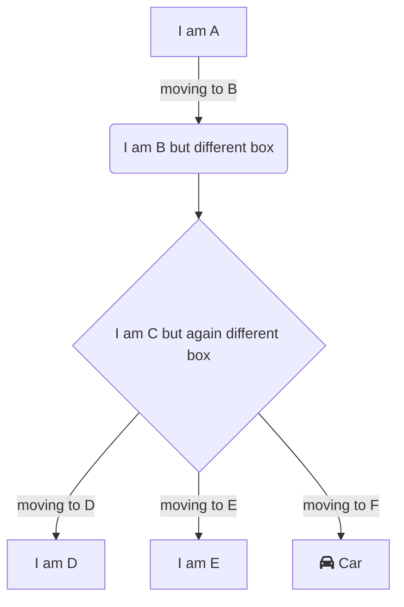

This file contains few examples to create mermaid diagram in GitHub Readme.md

```mermaid
  graph TD;
    A[I am A] -->|moving to B| B(I am B but different box)
    B --> C{I am C but again different box}
    C -->|moving to D| D[I am D]
    C -->|moving to E| E[I am E]
    C -->|moving to F| F[fa:fa-car Car]
```
